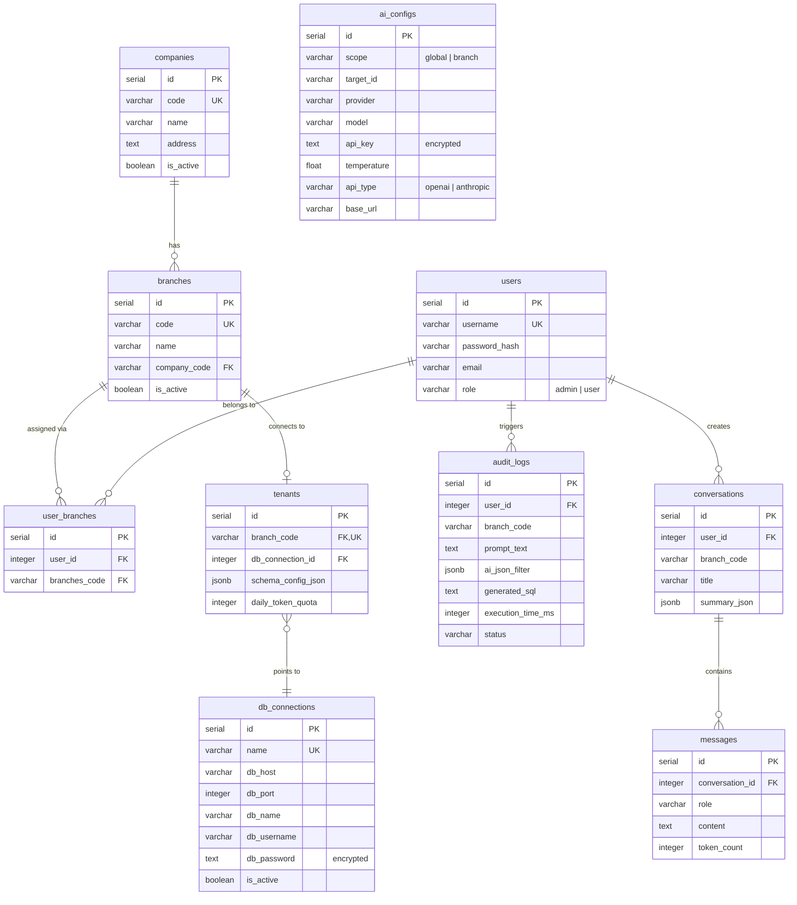

# 🤖 DMS AI Platform — AI-Powered Report & Database Management System

> Platform multi-tenant untuk mengelola database dan menghasilkan laporan berbasis AI. Admin dapat mengkonfigurasi koneksi database per cabang (branch), memilih AI provider (OpenAI / Anthropic), dan user cukup bertanya dalam bahasa natural untuk mendapatkan data.

---

## 📋 Daftar Isi

- [Arsitektur](#-arsitektur)
- [Tech Stack](#-tech-stack)
- [Prasyarat](#-prasyarat)
- [Instalasi & Setup](#-instalasi--setup)
- [Menjalankan Aplikasi](#-menjalankan-aplikasi)
- [Struktur Project](#-struktur-project)
- [Database Schema](#-database-schema)
- [API Endpoints](#-api-endpoints)
- [Akun Default](#-akun-default)
- [Environment Variables](#-environment-variables)

---

## 🏗 Arsitektur

```
┌─────────────────┐       ┌─────────────────────┐       ┌──────────────────┐
│   React + Vite  │──────▶│  FastAPI (Backend)   │──────▶│  PostgreSQL 15   │
│   (Frontend)    │  API  │  - Auth (JWT)        │  Core │  (Core Database) │
│   Port: 5173    │       │  - Admin CRUD        │  DB   │  Port: 5433      │
└─────────────────┘       │  - AI Orchestrator   │       └──────────────────┘
                          │  Port: 8000          │
                          └──────────┬───────────┘       ┌──────────────────┐
                                     │                   │  Redis 7         │
                                     ├──────────────────▶│  (Session/Cache) │
                                     │  Cache            │  Port: 6379      │
                                     │                   └──────────────────┘
                                     │
                                     │  AI Request       ┌──────────────────┐
                                     └──────────────────▶│  AI Provider     │
                                                         │  (OpenAI/Claude) │
                                                         └──────────────────┘
```

Sistem ini menggunakan arsitektur **multi-tenant**. Setiap cabang (branch) dapat terhubung ke database terpisah (tenant) sehingga data antar cabang terisolasi.

---

## 🛠 Tech Stack

### Backend
| Teknologi | Versi | Kegunaan |
|---|---|---|
| **Python** | 3.10+ | Bahasa pemrograman utama |
| **FastAPI** | 0.115 | Web framework (async) |
| **Uvicorn** | 0.34 | ASGI server |
| **asyncpg** | 0.30 | PostgreSQL async driver |
| **Pydantic** | 2.10 | Data validation & serialization |
| **python-jose** | 3.4 | JWT token handling |
| **passlib + bcrypt** | — | Password hashing |
| **cryptography (Fernet)** | 44.0 | Enkripsi kredensial tenant & API key |
| **sqlglot** | 26.3 | SQL parsing & validation |
| **Redis** | 5.2 | Caching & session store |

### Frontend
| Teknologi | Versi | Kegunaan |
|---|---|---|
| **React** | 19.x | UI library |
| **Vite** | 8.x | Build tool & dev server |
| **Tailwind CSS** | 4.x | Utility-first CSS framework |
| **Axios** | 1.19 | HTTP client |
| **Framer Motion** | 13.x | Animasi & transisi |
| **Recharts** | 3.x | Grafik & visualisasi data |
| **Lucide React** | 1.33 | Icon library |
| **React Hot Toast** | 2.6 | Notifikasi toast |

### Infrastructure
| Teknologi | Versi | Kegunaan |
|---|---|---|
| **Docker Compose** | 3.8 | Container orchestration |
| **PostgreSQL** | 15 | Database utama (core) |
| **Redis** | 7 | Session & cache layer |

---

## 📦 Prasyarat

Pastikan sudah terinstall di komputer Anda:

- [Python](https://www.python.org/) ≥ 3.10
- [Node.js](https://nodejs.org/) ≥ 18 (disarankan LTS)
- [Docker Desktop](https://www.docker.com/products/docker-desktop/) (untuk PostgreSQL & Redis)
- [Git](https://git-scm.com/)

---

## 🚀 Instalasi & Setup

### 1. Clone Repository

```bash
git clone https://github.com/kamachiii/AI-Reporting.git
cd AI-Reporting
```

### 2. Jalankan Database & Redis (Docker)

```bash
docker-compose up -d
```

Ini akan menjalankan:
- **PostgreSQL 15** di port `5433` (database: `ai-dms`)
- **Redis 7** di port `6379`

### 3. Setup Backend

```bash
cd backend

# Buat virtual environment
python -m venv .venv

# Aktivasi (Windows)
.venv\Scripts\activate

# Aktivasi (macOS/Linux)
# source .venv/bin/activate

# Install dependencies
pip install -r requirements.txt
```

### 4. Konfigurasi Environment

Buat file `backend/.env` (atau sesuaikan yang sudah ada):

```env
CORE_DB_HOST=localhost
CORE_DB_PORT=5433
CORE_DB_NAME=ai-dms
CORE_DB_USER=postgres
CORE_DB_PASSWORD=postgres

REDIS_URL=redis://localhost:6379/0

JWT_SECRET_KEY=super_secure_random_key_32_char_min

FERNET_KEY=<generate_dengan_python>
```

> **Tip:** Generate `FERNET_KEY` dengan menjalankan:
> ```python
> from cryptography.fernet import Fernet
> print(Fernet.generate_key().decode())
> ```

### 5. Inisialisasi Database

```bash
cd backend
python init_db.py
```

Script ini akan:
- Membuat semua tabel dari `sql/1_SCHEMA_BASE.sql`
- Membuat data awal (company, branch, user admin & user biasa)

#### (Opsional) Database Tenant Dummy — untuk testing AI

```bash
python seed_tenant_dummy.py --reset
```

Membuat database `dealer_dummy` di Postgres yang sama: 5 tabel (`kendaraan`, `pelanggan`, `penjualan`, `detail_penjualan`, `service_records`) berisi ±1.700 baris data dealer 12 bulan terakhir. Setelah dibuat, daftarkan di menu **Admin → Database & Tenant** lalu hubungkan ke cabang yang diinginkan. Tanpa `--reset`, script tidak akan menimpa database yang sudah ada.

### 6. Setup Frontend

```bash
cd frontend
npm install
```

---

## ▶ Menjalankan Aplikasi

### Backend (Terminal 1)

```bash
cd backend
.venv\Scripts\activate
uvicorn app.main:app --reload --port 8000
```

Backend tersedia di: **http://localhost:8000**
Dokumentasi API (Swagger): **http://localhost:8000/docs**

### Frontend (Terminal 2)

```bash
cd frontend
npm run dev
```

Frontend tersedia di: **http://localhost:5173**

---

## 📁 Struktur Project

```
ai-report-database-mandiri/
├── docker-compose.yml              # PostgreSQL + Redis containers
├── .github/workflows/ci.yml        # CI: lint+build frontend, syntax check backend
├── Readme.md
│
├── backend/
│   ├── .env                        # Environment variables (tidak di-commit)
│   ├── requirements.txt            # Python dependencies
│   ├── init_db.py                  # Init schema + migrasi otomatis + seeding
│   ├── tests/                      # Pytest (unit, tanpa DB)
│   │   ├── conftest.py
│   │   ├── test_ai_orchestrator.py # Exception passthrough AI gateway
│   │   └── test_sql_guard.py       # Katalog serangan SQL (TDD untuk F2.3)
│   ├── sql/
│   │   ├── 1_SCHEMA_BASE.sql       # Skema dasar (10 tabel)
│   │   └── migrations/             # Migrasi inkremental terlacak (idempotent)
│   │       ├── 001_users_is_active.sql
│   │       ├── 002_audit_logs_user_id_nullable.sql
│   │       └── 003_db_connection_registry.sql
│   └── app/
│       ├── main.py                 # FastAPI entry point
│       ├── core/
│       │   ├── config.py           # Settings + validasi fail-fast (JWT/FERNET)
│       │   ├── database.py         # PostgreSQL pool & Redis connection
│       │   └── security.py         # JWT, bcrypt, Fernet, guard admin (cek DB)
│       ├── routers/
│       │   ├── auth.py             # Login (rate limit anti brute-force)
│       │   └── admin/              # Satu modul per domain
│       │       ├── __init__.py     # Agregasi router admin
│       │       ├── companies.py    # Company & branch CRUD (transaksional)
│       │       ├── users.py        # CRUD user + assign cabang + guards
│       │       ├── db_connections.py # Registry database (kredensial terenkripsi)
│       │       ├── db_status.py    # Batch test-all koneksi database (paralel)
│       │       ├── tenants.py      # Relasi cabang ↔ database + test koneksi
│       │       ├── ai_configs.py   # AI config CRUD + fetch models + test-all
│       │       └── audit_logs.py   # Listing audit log (filter + pagination)
│       └── services/
│           └── ai_orchestrator.py  # Integrasi AI provider (OpenAI/Anthropic)
│
└── frontend/
    ├── package.json
    ├── eslint.config.js            # Lint gate (error = commit ditolak)
    ├── playwright.config.mjs
    ├── e2e/                        # Playwright: alur admin + visual regression
    └── src/
        ├── main.jsx
        ├── App.jsx                 # Routing by role (react-router) + notice sesi kadaluarsa
        ├── hooks/
        │   ├── useDebounce.js      # Debounce search input
        │   ├── useAdminShortcuts.js# Esc tutup modal, "/" fokus search
        │   └── useCompanyBranchData.js # Sumber data tunggal tab Perusahaan & Cabang
        ├── services/
        │   └── api.js              # Axios client + interceptor 401 auto-logout
        ├── utils/
        │   └── notification.js     # Wrapper toast seragam
        └── components/
            ├── LoginModal.jsx      # Halaman login
            ├── ErrorBoundary.jsx   # Penahan crash per-subtree
            └── Admin/
                ├── AdminLayout.jsx          # Sidebar + routing /admin/:tabSlug
                ├── CompanyBranchesTab.jsx   # Perusahaan & cabang (tab tipis)
                ├── TenantsTab.jsx           # Registry database & relasi (2 sub-tab)
                ├── AIConfigTab.jsx          # Konfigurasi AI provider
                ├── UsersTab.jsx             # Manajemen user & izin cabang
                ├── AuditLogTab.jsx          # Log audit query AI
                ├── common/                  # Komponen bersama
                │   ├── ConfirmationDialog.jsx
                │   ├── PaginationBar.jsx
                │   ├── SkeletonTable.jsx
                │   └── EmptyState.jsx       # Empty state ilustratif
                ├── company/                 # CompaniesTable, CompanyModal, CompanyDetailModal
                ├── branch/                  # BranchesTable, BranchModal, BranchDetailModal
                ├── tenants/                 # ConnectDbModal, DbConnectionModal
                ├── ai/                      # AIConfigModal, ModelPickerModal
                └── users/UserModal.jsx
```

### Konvensi Kode
- **Backend**: satu file router per domain (`routers/<domain>.py` atau `routers/admin/<domain>.py`).
- **Frontend tab**: file `*Tab.jsx` tipis (orkestrasi); modal di folder domainnya; dialog & pagination dari `common/`; shortcut keyboard via `useAdminShortcuts`.
- **Migrasi DB**: tambah file bernomor di `sql/migrations/NNN_<deskripsi>.sql` — dijalankan otomatis oleh `init_db.py`, terlacak di tabel `_migrations`.

---

## 🗄 Database Schema

Platform ini menggunakan **10 tabel** di database core (`ai-dms`):




---

## 🔌 API Endpoints

### Authentication
| Method | Endpoint | Deskripsi |
|---|---|---|
| `POST` | `/auth/login` | Login dengan username & password |

### Admin — Company
| Method | Endpoint | Deskripsi |
|---|---|---|
| `GET` | `/admin/companies` | Daftar semua company |
| `POST` | `/admin/companies` | Buat company baru |
| `PUT` | `/admin/companies/{code}` | Update company |
| `DELETE` | `/admin/companies/{code}` | Hapus company |

### Admin — Branch
| Method | Endpoint | Deskripsi |
|---|---|---|
| `GET` | `/admin/branches` | Daftar semua branch |
| `POST` | `/admin/branches` | Buat branch baru |
| `PUT` | `/admin/branches/{code}` | Update branch |
| `DELETE` | `/admin/branches/{code}` | Hapus branch |

### Admin — Database Registry (Kredensial)
| Method | Endpoint | Deskripsi |
|---|---|---|
| `GET` | `/admin/db-connections` | Daftar semua database terdaftar (tanpa password) |
| `POST` | `/admin/db-connections` | Daftarkan database (password terenkripsi Fernet) |
| `PUT` | `/admin/db-connections/{id}` | Update database (password kosong = tidak diubah) |
| `DELETE` | `/admin/db-connections/{id}` | Hapus dari registry (ditolak jika masih dipakai cabang) |
| `POST` | `/admin/db-connections/{id}/test-connection` | Tes koneksi satu database |
| `POST` | `/admin/db-connections/test-all` | Tes koneksi semua database secara paralel |

### Admin — Tenant (Relasi Cabang ↔ Database)
| Method | Endpoint | Deskripsi |
|---|---|---|
| `GET` | `/admin/tenants` | Daftar semua relasi cabang → database |
| `POST` | `/admin/tenants` | Hubungkan cabang ke database registry |
| `PUT` | `/admin/tenants/{branch_code}` | Ganti database milik cabang |
| `DELETE` | `/admin/tenants/{branch_code}` | Putuskan koneksi cabang (registry tetap) |
| `POST` | `/admin/tenants/{branch_code}/test-connection` | Tes koneksi database cabang |
| `POST` | `/admin/tenants/{branch_code}/refresh-schema` | Introspeksi skema DB tenant → simpan ke `schema_config_json` (jalan otomatis saat connect) |

### Admin — Users
| Method | Endpoint | Deskripsi |
|---|---|---|
| `GET` | `/admin/users` | Daftar user + cabang yang di-assign |
| `POST` | `/admin/users` | Buat user baru |
| `PUT` | `/admin/users/{id}` | Update user (password opsional) |
| `PUT` | `/admin/users/{id}/status` | Aktifkan / nonaktifkan user |
| `DELETE` | `/admin/users/{id}` | Hapus user permanen |

### Admin — Audit Log
| Method | Endpoint | Deskripsi |
|---|---|---|
| `GET` | `/admin/audit-logs` | Riwayat query AI (filter status/tanggal/pencarian + pagination) |

### Admin — AI Configuration
| Method | Endpoint | Deskripsi |
|---|---|---|
| `GET` | `/admin/ai-configs` | Daftar semua AI config |
| `POST` | `/admin/ai-configs` | Buat AI config baru |
| `PUT` | `/admin/ai-configs/{id}` | Update AI config |
| `DELETE` | `/admin/ai-configs/{id}` | Hapus AI config |
| `POST` | `/admin/ai-configs/{id}/test` | Test AI config |
| `POST` | `/admin/ai-configs/test-draft` | Test draft config |
| `POST` | `/admin/ai-providers/models` | Fetch daftar model dari provider |

> 💡 **Base URL provider** otomatis dinormalisasi (trailing slash dihapus) sebelum
> dipakai menghitung URL endpoint (`/models`, `/chat/completions`, `/messages`).
> Gateway dengan route-matching ketat (mis. B.AI) menolak path double-slash
> seperti `/v1//models`. Pastikan base_url sudah memuat prefix versi yang benar
> (mis. `https://api.b.ai/v1`) — host root tanpa `/v1` tetap akan ditolak gateway.

> 📖 Dokumentasi API lengkap tersedia di **http://localhost:8000/docs** (Swagger UI)

---

## 👤 Akun Default

Setelah menjalankan `init_db.py`, akun berikut tersedia:

| Username | Password | Role | Branch |
|---|---|---|---|
| `admin` | `admin123` | Admin | (tanpa — lihat semantik role) |
| `user_jkt` | `user123` | User | JKT_01 |

### Semantik Role (keputusan domain — WAJIB dipatuhi)

| Aturan | Penjelasan |
|---|---|
| **Admin = orang FBS** | Role admin khusus pengelola sistem (FBS). Dealer/client HANYA role `user` — tidak dimungkinkan menjadi admin. |
| **Admin tanpa cabang** | Admin mengelola seluruh sistem dan **tidak memiliki penugasan cabang**. Backend menolak (400) dan menghapus otomatis cabang milik admin; UI menyembunyikan bagian cabang untuk admin. |
| **Admin tanpa akses chat** | Fitur chat AI (F3) hanya untuk role `user`. Admin memantau lewat panel admin + Audit Log. |
| **Scope AI Global tunggal** | Hanya boleh ada **1** config scope `global` — dijamin partial unique index di database. Membuat global kedua mengembalikan **409**; frontend menawarkan update-in-place. |
| **Target scope valid** | Scope `tenant`/`user` wajib menunjuk cabang-terhubung/username yang nyata (divalidasi backend; UI berupa autocomplete, bukan input bebas). |
| **Password minimal 8 karakter** | Untuk akun baru & perubahan password. |

> ⚠️ **Penting:** Ganti password default sebelum deploy ke production!

---

## ⚙ Environment Variables

| Variable | Deskripsi | Default |
|---|---|---|
| `CORE_DB_HOST` | Host PostgreSQL | `localhost` |
| `CORE_DB_PORT` | Port PostgreSQL | `5433` |
| `CORE_DB_NAME` | Nama database core | `ai-dms` |
| `CORE_DB_USER` | Username PostgreSQL | `postgres` |
| `CORE_DB_PASSWORD` | Password PostgreSQL | `postgres` |
| `REDIS_URL` | URL koneksi Redis | `redis://localhost:6379/0` |
| `JWT_SECRET_KEY` | Secret key untuk JWT token | — |
| `FERNET_KEY` | Key untuk enkripsi kredensial | — |

---

## 🔒 Keamanan

- **JWT Authentication** — Token berbasis HS256 dengan masa berlaku 24 jam
- **Bcrypt Password Hashing** — Password di-hash menggunakan bcrypt
- **Fernet Encryption** — Kredensial database tenant dan API key AI dienkripsi saat disimpan
- **Role-Based Access Control** — Endpoint admin dilindungi dengan middleware `require_admin_role`
- **CORS** — Hanya origin tertentu yang diizinkan (localhost dev server)
- **Rate Limit Login** — Maksimal 5 percobaan gagal per kombinasi username+IP dalam 60 detik (in-memory; hitungan reset saat backend restart — cukup untuk single-instance)

---

## 📄 Lisensi

Project ini dibuat sebagai bagian dari program **PKL (Praktik Kerja Lapangan)**.

---

<p align="center">
  Dibuat dengan menggunakan FastAPI + React
</p>
