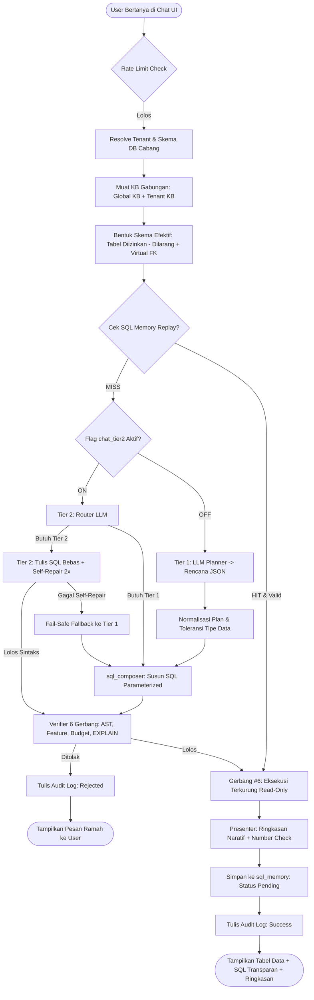

# 📘 Buku Panduan Teknis Pengembang (Developer Handbook)
## DMS AI Platform — Multi-Tenant Conversational Database Reporting

> **Untuk Programmer & AI Agent yang Melanjutkan Proyek Ini:**
> Dokumen ini adalah panduan teknis komprehensif untuk memahami, memelihara, dan mengembangkan **DMS AI Platform**. Baca dokumen ini bersama dengan [PROGRES-IMPLEMENTASI.md](file:///d:/Kerja%20PKL/ai-report-database-mandiri/docs/PROGRES-IMPLEMENTASI.md) dan [PERANCANGAN-PIPELINE-AI-v2.md](file:///d:/Kerja%20PKL/ai-report-database-mandiri/docs/PERANCANGAN-PIPELINE-AI-v2.md).

---

## 1. Ringkasan Sistem & Filosofi Desain

**DMS AI Platform** adalah sistem pelaporan berbasis AI natural language untuk database dealer otomotif (*Dealer Management System* / DMS) dengan multi-tenant isolation dan standar keamanan enterprise.

### Prinsip Desain Utama:
1. **Bukan Text-to-SQL Naif (Dua-Tier)**:
   - Membiarkan LLM menulis SQL bebas tanpa dipagari langsung ke database produksi adalah resep bencana (rawan syntax error, halusinasi nama tabel/kolom, kebocoran data, dan query berat).
   - Sistem ini menggunakan arsitektur **Dua Tier**:
     - **Tier 1 (Deterministik, 90% Kasus)**: LLM hanya merancang *rencana JSON* $\rightarrow$ program internal (`sql_composer.py`) yang mengonversi JSON menjadi query SQL berparameter ($1, $2, ...).
     - **Tier 2 (Analitik Kompleks)**: LLM menulis SQL langsung, namun **wajib lolos Verifier 6 Gerbang** (default-deny AST parsing, fitur berizin, budget limit, EXPLAIN pre-flight) dan eksekusi terkurung (*read-only*, 10s timeout, 500 baris cap).
2. **Data Trust Model (Model A — On-Premises Isolation)**:
   - Data nasabah dan transaksi finansial **TIDAK PERNAH** dikirimkan ke server pihak ketiga.
   - Yang dikirimkan ke LLM hanyalah metadata skema ringkas, catatan kamus istilah (Knowledge Base), dan contoh query. Hasil query dieksekusi secara lokal pada koneksi database per-cabang.
3. **Pemberian Keyakinan Berlapis (Confidence Score)**:
   - **Level A**: Hasil dari *SQL Memory Replay* yang sudah dikonfirmasi manusia (0 panggilan LLM, latensi milidetik).
   - **Level B**: Hasil dari *Tier 1 Composer* (deterministik, terstruktur).
   - **Level C**: Hasil dari *Tier 2 Generator* (SQL bebas yang lolos verifier ketat).

---

## 2. Diagram Alur Pipeline AI (End-to-End)



---

## 3. Struktur Direktori Proyek

```
ai-report-database-mandiri/
├── backend/
│   ├── app/
│   │   ├── core/
│   │   │   ├── config.py             # Konfigurasi aplikasi via pydantic-settings (.env)
│   │   │   ├── database.py           # Connection pool PostgreSQL inti (core DB)
│   │   │   └── security.py           # Auth JWT, password hash bcrypt, enkripsi Fernet
│   │   ├── routers/
│   │   │   ├── auth.py               # Login & refresh token JWT
│   │   │   ├── chat.py               # Endpoint utama chat query, feedback, & history
│   │   │   └── admin/
│   │   │       ├── companies.py      # CRUD perusahaan induk
│   │   │       ├── branches.py       # CRUD cabang / dealer
│   │   │       ├── connections.py   # Registry database tenant
│   │   │       ├── tenants.py        # Relasi cabang <-> database & toggle Tier 2
│   │   │       ├── ai_configs.py     # Konfigurasi LLM provider (OpenAI/Anthropic/Custom)
│   │   │       ├── users.py          # Manajemen user, role, & akses cabang
│   │   │       ├── audit_logs.py     # Riwayat query AI, durasi, & sorting server-side
│   │   │       ├── global_kb.py      # CRUD Global Knowledge Base (SSOT)
│   │   │       └── eval.py           # Eval Harness & Golden-Set benchmark
│   │   ├── services/
│   │   │   ├── chat_pipeline.py      # Orchestrator alur chat utama
│   │   │   ├── query_planner.py      # LLM Planner Tier 1 (merancang JSON)
│   │   │   ├── sql_composer.py       # Komposer deterministik JSON -> SQL berparameter
│   │   │   ├── tier2_generator.py    # Generator SQL bebas Tier 2 + self-repair
│   │   │   ├── sql_guard.py          # Verifier AST sqlglot & whitelist fitur
│   │   │   ├── query_verifier.py     # Verifier wrapper (Gate 1 - 5 + EXPLAIN pre-flight)
│   │   │   ├── query_executor.py     # Gerbang #6: eksekusi terkurung di DB tenant
│   │   │   ├── presenter.py          # Ringkasan bahasa natural + NUMBER CHECK anti-halusinasi
│   │   │   ├── knowledge_base.py     # Penggabungan KB, skema efektif, & Virtual FK
│   │   │   ├── tenant_pool.py        # Single interface koneksi ke DB tenant
│   │   │   ├── eval_runner.py        # Benchmark golden set & gate aktivasi Tier 2
│   │   │   └── vanna_sync.py         # Snapshot sync dari Vanna API lama
│   │   └── main.py                   # Entrypoint FastAPI, CORS middleware, lifespan
│   ├── sql/
│   │   ├── schema.sql                # Skema dasar database inti
│   │   ├── seed.sql                  # Data awal (admin default, cabang demo)
│   │   └── migrations/               # Migrasi berurutan (001 s/d 011)
│   ├── tests/                        # 23 berkas test suite pytest (507+ unit tests)
│   ├── init_db.py                    # Script inisialisasi & migrasi idempotent
│   └── requirements.txt
│
├── frontend/
│   ├── src/
│   │   ├── components/
│   │   │   ├── Admin/                # Dashboard Admin (Perusahaan, Tenant, User, AI, Audit)
│   │   │   │   ├── common/           # SortIcon, PaginationBar, EmptyState, Modal
│   │   │   │   ├── company/          # Tabel & form perusahaan
│   │   │   │   ├── branch/           # Tabel & form cabang
│   │   │   │   ├── tenants/          # Database registry, koneksi, & Global KB Modal
│   │   │   │   ├── users/            # Tabel & form pengguna
│   │   │   │   └── ai/               # Tabel & modal konfigurasi model AI
│   │   │   └── User/                 # Chat interface bagi user cabang
│   │   │       ├── UserWorkspace.jsx # Antarmuka chat interaktif
│   │   │       └── AssistantAnswerCard.jsx # Render tabel data, SQL transparan, & ringkasan
│   │   ├── services/
│   │   │   └── api.js                # Axios client ke backend API
│   │   └── hooks/                    # useDebounce, useAdminShortcuts, useCompanyBranchData
│   └── package.json
│
└── docs/                             # Dokumentasi arsitektur & histori implementasi
```

---

## 4. Panduan Menjalankan Lingkungan Lokal (Dev Setup)

### Prasyarat
- Windows / Linux / macOS
- Docker Desktop (untuk PostgreSQL core & Redis)
- Python 3.10+ (disarankan 3.12)
- Node.js 18+ (LTS)

### Langkah 1: Jalankan Database Core via Docker
```powershell
# Dari direktori root proyek
docker compose up -d
```
*Port mapping: PostgreSQL core berjalan di port `5433`, Redis di port `6379`.*

### Langkah 2: Setup & Inisialisasi Backend
```powershell
cd backend

# Buat virtual environment jika belum ada
python -m venv .venv

# PENTING: Gunakan Python venv untuk seluruh instalasi & eksekusi!
.venv\Scripts\python.exe -m pip install -r requirements.txt

# Inisialisasi database core & jalankan migrasi (jalankan 2x untuk uji idempotency)
.venv\Scripts\python.exe init_db.py
.venv\Scripts\python.exe init_db.py

# Jalankan server backend
.venv\Scripts\python.exe -m uvicorn app.main:app --reload --port 8000
```

### Langkah 3: Setup & Jalankan Frontend
```powershell
cd frontend
npm install
npm run dev
```
*Frontend berjalan di `http://localhost:5173/` (atau port dinamis `5174` jika 5173 sibuk).*

### Akun Bawaan untuk Uji Coba:
| Username | Password | Role | Akses Cabang | Database Terhubung |
| :--- | :--- | :--- | :--- | :--- |
| `admin` | `admin123` | **admin** | Panel Admin Semua Cabang | Database Core |
| `tester01` | `tester123` | **user** | `TST_01` (Dealer Demo) | `backup_demo_otobitzcloud` (2.387 tabel) |
| `user_jkt` | `user123` | **user** | `JKT_01` (Cabang Jakarta) | `aleza-si` |

---

## 5. Komponen-Komponen Krusial & Cara Kerjanya

### 5.1. Database Registry & Tenant Isolation (`tenant_pool.py`)
- Kredensial database tenant (host, port, user, password) disimpan terenkripsi menggunakan Fernet (`cryptography`) pada tabel `db_connections`.
- Semua koneksi ke DB tenant **WAJIB** melalui interface tunggal:
  ```python
  from app.services.tenant_pool import get_tenant_pool_manager
  manager = get_tenant_pool_manager()
  pool = await manager.get_pool(tenant_dict)
  async with pool.acquire() as conn:
      # Jalankan query terisolasi di database cabang tersebut
  ```
- Ini menjamin data antar cabang tidak pernah bercampur dan siap jika arsitektur dipindah ke model outbound agent.

### 5.2. Knowledge Base & Virtual Foreign Key (`knowledge_base.py`)
Database warisan (*legacy DMS*) sering kali memiliki ribuan tabel **tanpa DDL foreign key resmi** di database PostgreSQL. Jika AI diminta menggabungkan data, komposer akan gagal mencari jalur relasi (*No FK path*).
- **Solusi Kami**: **Virtual Foreign Key**.
- Diatur di KB cabang dalam format JSON:
  ```json
  "relasi_tabel": [
    {
      "dari_tabel": "untt_pembelian",
      "dari_kolom": "norangka",
      "ke_tabel": "untt_datakendaraan",
      "ke_kolom": "norangka"
    }
  ]
  ```
- Fungsi `suntikkan_relasi_ke_skema` akan menyuntikkan relasi ini ke skema memori runtime tanpa menyentuh DDL fisik database klien.

### 5.3. Verifier 6 Gerbang (`query_verifier.py` & `sql_guard.py`)
Semua query SQL yang dihasilkan (baik dari Tier 1 maupun Tier 2) wajib lolos gerbang default-deny:
1. **Gerbang #1 (Single Statement)**: Menolak titik koma ganda `;`, comment injection, dan perintah manipulasi data (DML non-SELECT seperti `INSERT`, `UPDATE`, `DELETE`, `DROP`, `TRUNCATE`).
2. **Gerbang #2 (AST Whitelist sqlglot)**: Mengurai query menjadi pohon sintaks abstrak (AST). Semua node AST harus terdaftar di whitelist.
3. **Gerbang #3 (Feature Profile Versioned)**: Memastikan fitur SQL yang dipakai (seperti fungsi agregasi `SUM`, `COUNT`, klausa `GROUP BY`, `JOIN`) sesuai dengan profil `SQL_FEATURE_PROFILE_V1`.
4. **Gerbang #4 (Complexity Budget)**: Batas maksimal join tabel (maks 5), batas kedalaman subquery (maks 2 tingkat), dan batas fungsi agregasi agar query tidak membebani server.
5. **Gerbang #5 (EXPLAIN Pre-Flight)**: Menjalankan `EXPLAIN (FORMAT JSON)` di database tenant secara *read-only* untuk memeriksa estimasi cost dan memvalidasi tipe data sebelum query sebenarnya dieksekusi.
6. **Gerbang #6 (Eksekusi Terkurung / Confinement)**:
   - Dijalankan di dalam transaksi PostgreSQL eksplisit: `SET TRANSACTION READ ONLY;`
   - Dibatasi timeout ketat: `SET statement_timeout = '10s';`
   - Dibatasi baris maksimal (Row Cap): maksimal 500 baris.

### 5.4. Presenter & NUMBER CHECK (`presenter.py`)
Salah satu kelemahan terbesar LLM adalah **halusinasi angka** saat meringkas data.
- **Presenter kami memiliki fitur mekanis NUMBER CHECK**:
  - LLM menulis ringkasan deskriptif dalam Bahasa Indonesia.
  - Sistem mengekstrak semua angka dari teks ringkasan (misal: "Rp 350.600.000", "12 unit").
  - Sistem memvalidasi apakah angka tersebut **faktual ada** di dalam baris data hasil query database.
  - Jika LLM mengarang angka yang tidak ada di hasil query, sistem otomatis membatalkan ringkasan LLM dan beralih ke **fallback template deterministik** yang 100% akurat.

### 5.5. SQL Memory (`chat_pipeline.py`)
- Setiap query yang berhasil dijawab dan diverifikasi akan disimpan ke tabel `sql_memory` dengan status `pending`.
- Ketika user di chat mengklik tombol *"Jawaban benar"*, status dinaikkan menjadi `approved`.
- Jika ada pertanyaan serupa di masa mendatang, sistem akan melakukan **Memory Replay**:
  - Query langsung diambil dari memori (0 panggilan API LLM, 0 biaya token, respons instan < 50ms).
  - Status keyakinan menjadi **Level A**.
  - **Anti-Data-Basi**: Jika SQL memory memuat literal tanggal statis (misal `2026-08-01`), sistem menganggapnya *MISS* agar tidak menyajikan data periode lama yang kadaluwarsa.

---

## 6. Aturan Emas & Jebakan Teknis (Wajib Dipatuhi)

1. **JANGAN PERNAH Gunakan String Formatting (f-string) untuk SQL**:
   - Semua query `asyncpg` **WAJIB berparameter** (`$1, $2, ...`).
   - Contoh salah: `await conn.execute(f"SELECT * FROM users WHERE id = {user_id}")`
   - Contoh benar: `await conn.execute("SELECT * FROM users WHERE id = $1", user_id)`
2. **Aturan Migrasi Database**:
   - Semua file migrasi di `backend/sql/migrations/` harus berurutan (`012_*.sql`, `013_*.sql`).
   - File migrasi **TIDAK BOLEH mengandung karakter titik-koma (`;`) di dalam komentar SQL**, karena script `init_db.py` memecah statement berdasarkan `;`.
   - File migrasi harus bersifat **idempotent** (`IF NOT EXISTS`, `ON CONFLICT DO NOTHING`).
   - Selalu sediakan file rollback terpisah: `012_*_rollback.sql`.
3. **Konvensi Frontend**:
   - Gunakan token tema custom yang sudah didefinisikan (`bg-canvas`, `border-hairline`, `bg-surface-soft`, `text-primary`, `text-muted`, `text-ink`). Jangan sembarangan menambahkan warna heksadesimal baru di luar tema.
   - Wajib lolos `npm run lint` dengan **0 error**.
   - Wajib lolos `npm run build` dengan **exit code 0**.
4. **Verifikasi Sebelum Mengklaim Selesai**:
   - Selalu jalankan checklist standar verifikasi sebelum melakukan commit:
     ```powershell
     # Backend
     .venv\Scripts\python.exe -m compileall app
     .venv\Scripts\python.exe -m pytest tests/ -q
     
     # Frontend
     npm run lint
     npm run build
     ```

---

## 7. Referensi Endpoint API Utama

| Method | Endpoint | Guard | Deskripsi |
| :--- | :--- | :--- | :--- |
| `POST` | `/auth/login` | Publik | Login username/password, menghasilkan JWT token |
| `POST` | `/chat/query` | `require_user_role` | Mengajukan pertanyaan natural language ke AI |
| `POST` | `/chat/feedback` | `require_user_role` | Konfirmasi jawaban benar (promosi ke SQL Memory) |
| `GET` | `/chat/history` | `require_user_role` | Riwayat percakapan pengguna |
| `GET` | `/admin/companies` | `require_admin_role` | Daftar perusahaan induk |
| `GET` | `/admin/branches` | `require_admin_role` | Daftar seluruh cabang / dealer |
| `GET` | `/admin/connections` | `require_admin_role` | Registry koneksi database tenant |
| `POST` | `/admin/tenants/{branch}/tier2` | `require_admin_role` | Toggle aktivasi Tier 2 (dengan security gate) |
| `POST` | `/admin/tenants/{branch}/refresh-schema`| `require_admin_role` | Introspeksi skema database cabang |
| `GET` | `/admin/ai-configs` | `require_admin_role` | Daftar konfigurasi provider model AI |
| `GET` | `/admin/users` | `require_admin_role` | Manajemen pengguna & izin cabang |
| `GET` | `/admin/audit-logs` | `require_admin_role` | Log aktivitas AI (server-side sort & filter) |
| `GET` | `/admin/global-kb/items` | `require_admin_role` | Daftar item Global Knowledge Base |
| `POST` | `/admin/global-kb/items` | `require_admin_role` | Menambah aturan/contoh baru ke Global KB |
| `POST` | `/admin/tenants/{branch}/eval-run` | `require_admin_role` | Menjalankan benchmark eval Golden-Set |
| `GET` | `/admin/tenants/{branch}/eval-runs` | `require_admin_role` | Riwayat metrik evaluasi per cabang |

---

## 8. Sisa Kerja & Roadmap Pengembangan Lanjutan

Fitur yang telah selesai diimplementasikan meliputi:
- **Auto-Adaptive Visual Charts (0-Token)**: Grafik Recharts interaktif dinamis (Bar/Line toggle).
- **Ekspor Excel Berformat & Grafik Asli (`openpyxl`)**: Unduh file `.xlsx` akuntansi dengan native embedded charts.
- **Interactive Clarification Loop (0-Token)**: Dialog klarifikasi instan pra-eksekusi untuk istilah ambigu (misal Oli Unit vs Sparepart).
- **Arsitektur Proaktif Multi-Table 3S (Query Fan-Out)**: Analisis komprehensif Sales, Service, Sparepart dalam 1 kueri paralel.
- **Admin AI Metrics & Quota Management**: Dashboard analitik utilisasi token, tren 7-hari, dan kontrol kuota per-cabang real-time.

Daftar backlog / opsi pengembangan berikutnya:
1. **Dedicated Executive Dashboard Page**:
   - Halaman khusus dashboard eksekutif (grid widget 32 KPI dealer dari acuan file Excel `20260327 - Design Dashboard.xlsx`) yang langsung menyajikan metrik tanpa harus mengajukan pertanyaan chat.
2. **Ekspor PDF Laporan Eksekutif Siap Cetak (Sisa F5)**:
   - Fitur ekspor/cetak laporan PDF formal dengan kop dealer, ringkasan naratif, tabel angka, dan tanda tangan pejabat dealer.
3. **Hardening Multi-Instance Skala Enterprise (Sisa F6)**:
   - Redis Distributed Rate Limiter & Distributed Schema Cache untuk kesiapan deployment multi-replica (horizontal scaling).
